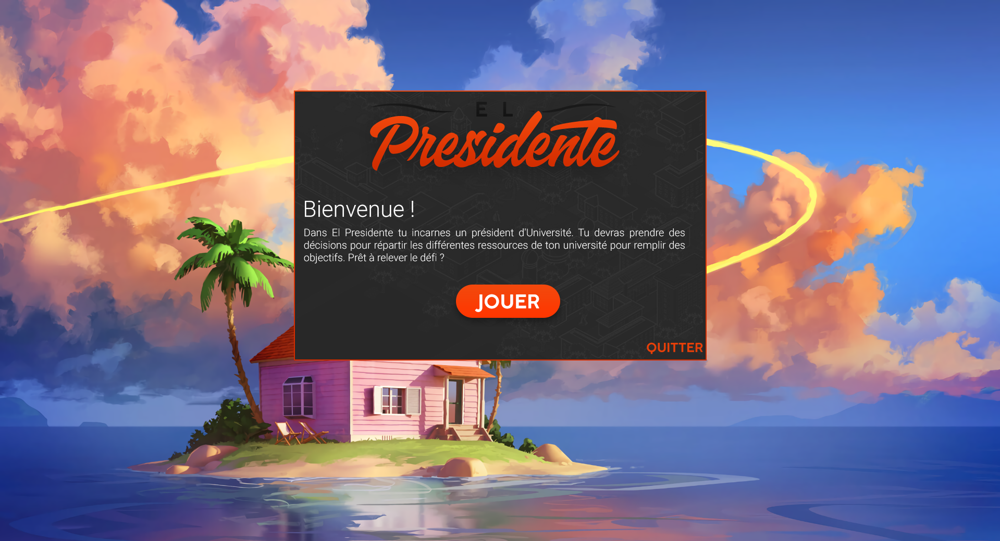
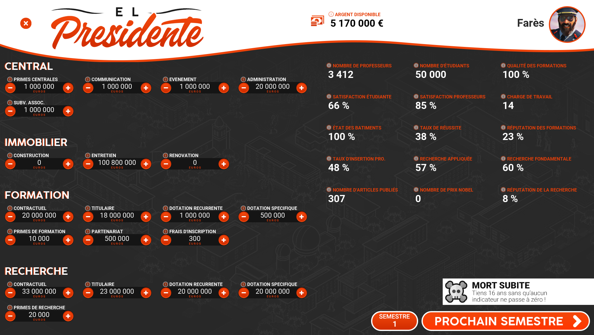
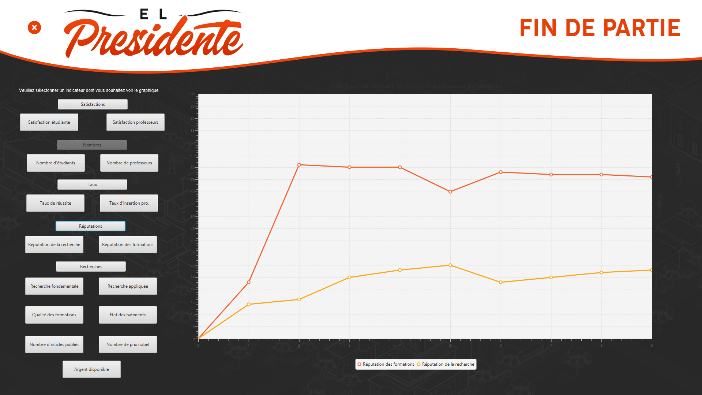

# Projet T3 : El Presidente


## Présentation du jeu
El Presidente est un [Serious Game](https://fr.wikipedia.org/wiki/Jeu_s%C3%A9rieux) où le joueur incarne le
président d'une université. Il doit donc au fil de la partie prendre des décisions afin de répartir au mieux les différentes
ressources de son université.<br /><br /> Au travers d'El Presidente le joueur se rendra compte de la complexité que représente la gestion
d'une université et la nécessité de faire des compromis pour que l'université puisse fonctionner au mieux.

## Captures d'écrans du jeu
Ecran d'accueil


Options de la partie


Ecran de jeu


Ecran de fin de partie



## Exécution du jeu
El Presidente n'a pas besoin d'être installé, il suffit de lancer son exécutable.
### Pré-requis
Java doit être installé sur votre ordinateur (minimum en version 8) : [Téléchargement de Java](https://www.java.com/fr/download/  "Lien vers la dernière version de Java").

### Exécution
- Télécharger le [JAR exécutable](https://mega.nz/#!1oclFCDT!uf2vEvZwjd4v7s5EJXrjiJMuveqQu-qarmwIZA39KLw "Lien vers le JAR exécutable").

- Lancer le JAR exécutable, soit en double-cliquant dessus (Windows) soit en ligne de commande (Windows et Linux) :
```shell
java -jar elpresidente.jar
```

**Note :** L'exécutable actuel ne permet pas de lancer le jeu (voir partie "Compilation"). Il est recommandé d'exécuter le projet
depuis un IDE Java (comme Eclipse ou IntelliJ IDEA).

## Compilation du jeu (si modification du code)
Si vous souhaitez modifier le code et créer un nouvel exécutable suivez cette démarche (sur IntelliJ IDEA).

### Pré-requis
Le Java Development Kit (JDK) doit être installé sur votre ordinateur (minimum en version 8) : [Téléchargement de JDK](https://www.oracle.com/technetwork/java/javase/downloads/jdk11-downloads-5066655.html  "Lien vers le JDK 11")

### Compilation
- Ouvrir l'ensemble du répertoire sur IntelliJ IDEA.

- Dans *File > Project Structure -> Project Settings -> Artifacts ->  Icône + -> JAR -> From modules with dependencies* -> Sélectionner la class **GameView** dans "Main Class" puis **"Ok"**

- Dans le menu *Build -> Build Artifact ->* Sélectionner l'artifact précedemment configuré puis **"Build"**

- Le fichier *elpresidente.jar* a été créé dans le dossier *out -> artifacts -> elpresidente*

**ATTENTION :** La compilation de projets JavaFX est devenue impossible en utilisant le compileur JDK depuis la version 8,
il existe des solutions (comme la convertion Maven ou le downgrade en version 8 dans certains cas). 

## Déroulement d'une partie
### Lancement d'une partie
A l'ouverture du jeu une courte introduction est présentée. Par la suite le joueur peut choisir un nom et un scénario.
Actuellement il existe deux scénario :
- **Mort subite :** le joueur doit maintenir l'université avec aucun indicateur dans un état critique (proche de 0) pendant 16 ans.
- **Objectif :** le joueur doit atteindre un objectif pour gagner (actuellement l'objectif est de faire parvenir la réputation de la recherche à 45% en 9 semestres.

### En jeu
Le jeu s'organise en semestres. Chaque semestre le joueur doit prendre des décisions pour répartir les ressources de son université.
<br /></br >
Après avoir lancé une partie, une fenêtre sera présentée au joueur avec d'un côté (gauche) les leviers et de l'autre (droit) indicateurs. Les ***leviers*** sont un ensemble de paramètres que le joueur peut modifier tout le long du jeu. C'est à travers de ces leviers que le joueur appliquera sa stratégie. Quant à eux les ***indicateurs*** sont l'ensemble des informations affichées qui permettront au joueur de constater l'effet des décisions prises auparavant à travers les leviers. Les indicateurs sont donc influencés par un ou plusieurs leviers. 

### Fin de partie
En fonction du scénario choisi la partie se terminera en fonction de conditions différentes. Que le joueur perde ou gagne il arrivera
sur un écran final où il pourra lire les graphiques de l'évolution de ses différents indicateurs afin de se rendre compte de sa stratégie.

## Membres du projet
* Yoann LOUAZEL
* Farès ZOUITNI
* Tony LE

## Liens
-  [Téléchargement du JAR exécutable](https://mega.nz/#!1oclFCDT!uf2vEvZwjd4v7s5EJXrjiJMuveqQu-qarmwIZA39KLw "Lien vers le JAR exécutable")

-  [La documentation du code source](http://doc-elpresidente.1d-works.fr "Documentation du code El Presidente")  

-  [Le Wiki du jeu](https://git.unistra.fr/t432_haj19_t3_b/elpresidente/wikis/Home  "Page Wiki du jeu afin d'acquérir des informations supplémentaires")